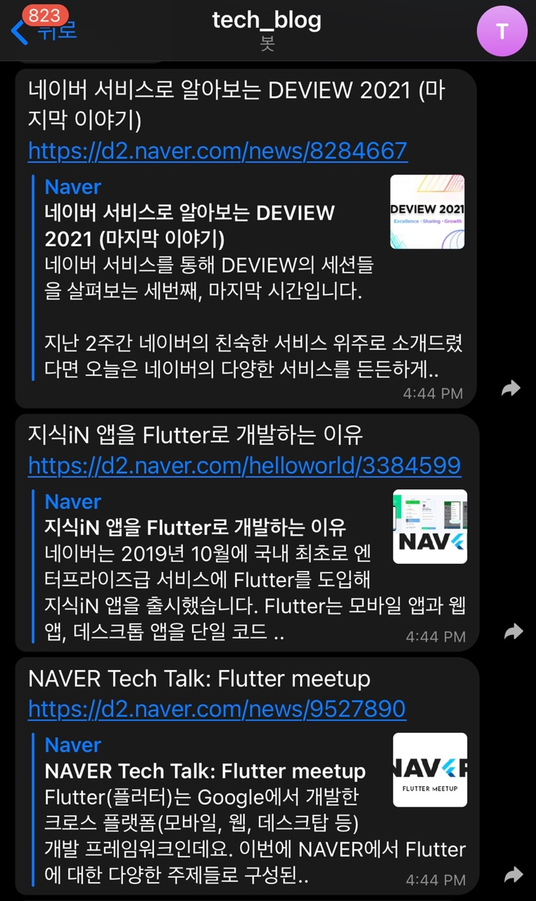

# 기술 블로그 컨텐츠 알리미
이 프로젝트는 RSS 피드 기반 블로그 컨텐츠 수집 및 텔레그램 알림 목적으로 개발되었습니다.
- 텔레그램 게시 예시  

How to Use?  
---
1. pip install -r requirements.txt 로 필요한 패키지 다운로드
2. 텔레그램 봇 생성
    1. /start
    2. /newbot
    3. bot 이름 생성
    4. bot 아이디 생성
3. batch/telegram_alerts.py **MY_TOKEN**, **CHAT_ID**에 자신의 토큰과 아이디 입력 (채팅방에 임의의 채팅을 보낸 후 bot.getUpdates()[0].message.chat.id로 조회)
4. telegram_alerts.py 실행시 텔레그램 컨텐츠 게시
5. resources/sites.txt 파일에 기존 마음에 들지 않는 url을 삭제하거나 자신이 구독하고 싶은 url을 입력
  
- 최근 한달내에 사이트에 게시된 컨텐츠 중 아직 채팅방에 올라가지 않은 컨텐츠를 채팅방에 알립니다.
- 배치 스크립트를 스케쥴링을 걸어 운영하세요.

현재 포함된 기술 블로그 목록
---
- [네이버 D2](https://d2.naver.com/d2.atom)
- [라인](https://engineering.linecorp.com/ko/feed/)
- [우아한형제들](https://techblog.woowahan.com/feed/)
- [마켓컬리](https://helloworld.kurly.com/feed.xml)
- [뱅크샐러드](https://blog.banksalad.com/rss.xml)
- [nhn cloud](https://meetup.toast.com/rss)
- [하이퍼커넥트](https://hyperconnect.github.io/feed)
- [당근마켓](https://medium.com/feed/daangn)
- [딜리버리히어로코리아](https://medium.com/feed/deliverytechkorea)
- [이스트소프트](https://blog.est.ai/feed/)
- [스포카](https://spoqa.github.io/rss)
- [쏘카](https://tech.socarcorp.kr/feed)
- [넷플릭스](https://netflixtechblog.com/feed)
- [링크드인](https://engineering.linkedin.com/blog.rss.html)
- [페이팔](https://medium.com/feed/paypal-tech)
- [월마트](https://medium.com/feed/walmartglobaltech)
- [카카오](https://tech.kakao.com/feed/)